# TALTAL

> 방탈출 검색부터 기록, 리뷰, 동행 모집, 추천까지 한곳에서 관리하는 방탈출 통합 플랫폼

**TALTAL**은 여러 매장에 흩어져 있는 방탈출 정보 탐색 및 플레이 기록과 취향을 기반으로 새로운 테마를 발견하고 이를 함께 플레이할 사람까지 찾을 수 있도록 만든 개인 풀스택 프로젝트

기존 방탈출 서비스를 사용하면서 느꼈던 **정보 탐색의 파편화**, **플레이 기록 관리의 불편함**, **동행 모집의 어려움**을 하나의 서비스 흐름으로 연결하는 것을 목표로 시작

현재는 실제 상용 서비스 출시보다는 **제품 아이디어를 동작하는 풀스택 프로토타입으로 구현하는 것**에 초점을 맞추고 있음

---

## Features

### 1. 통합 테마 검색

지역, 장르, 난이도 등의 정보를 기반으로 방탈출 테마를 탐색할 수 있음.

- 서울 지역 방탈출 매장 및 테마 데이터 구축
- 현재 위치 / 지역 기반 탐색
- 테마 상세 정보 확인
- 예약 플로우 제공
- 가격, 장르, 난이도, 평점 등 비교

<p align="center">
  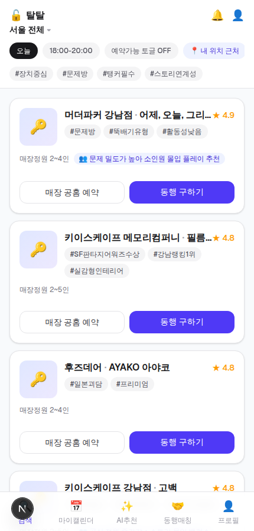
  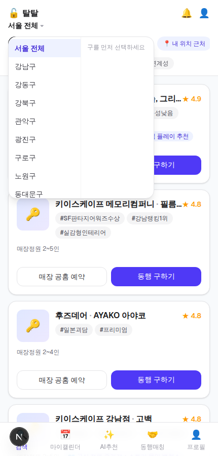
  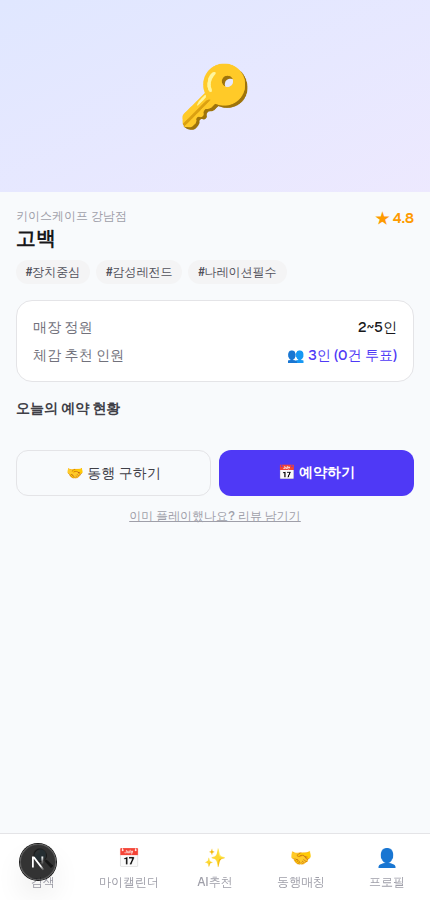
</p>

---

### 2. 예약 및 플레이 기록

검색한 테마를 예약하고 플레이 기록을 개인 프로필에 누적할 수 있도록 구현했음.

플레이 기록은 단순한 히스토리뿐 아니라 이후 **사용자 스탯 및 추천 시스템의 입력 데이터**로 활용됨.

<p align="center">
  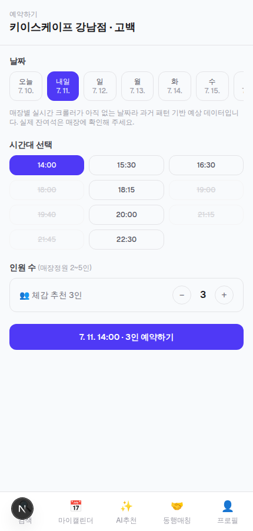
  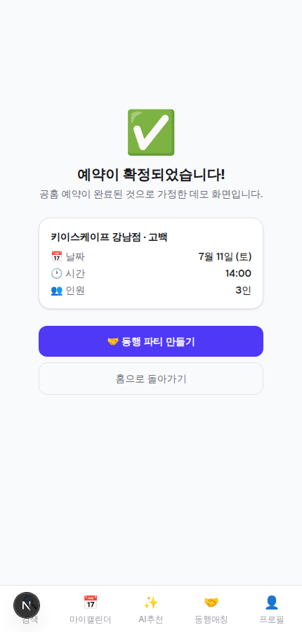
  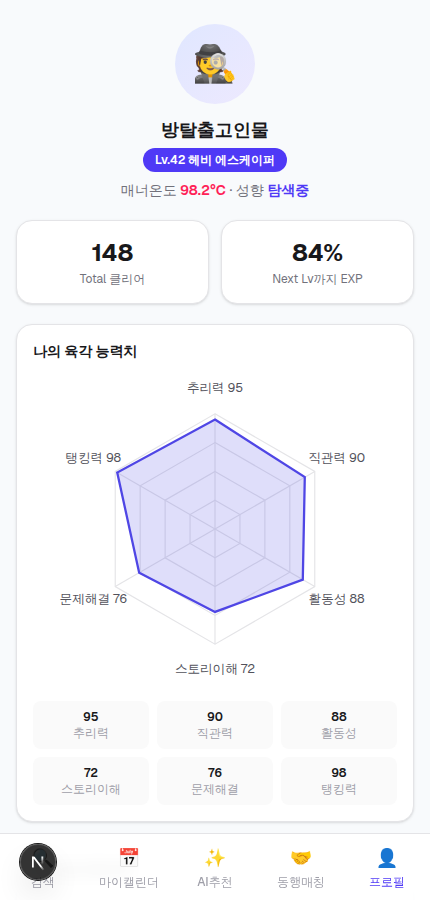
</p>

---

### 3. 플레이 스타일 프로필

플레이 기록을 기반으로 사용자의 방탈출 성향을 육각형 스탯으로 표현하도록 구현함

단순히 플레이한 테마 수를 보여주는 것을 넘어 사용자의 **장르 선호도와 플레이 스타일**을 시각적으로 확인할 수 있도록 구성함

<p align="center">
  
  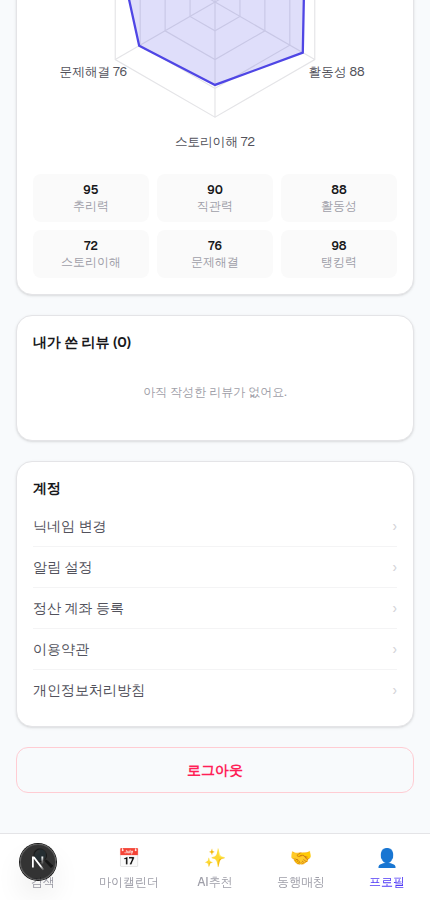
</p>

---

### 4. 동행 모집

혼자 예약하기 어려운 테마를 위해 다른 사용자와 파티를 구성할 수 있는 기능을 구현함

현재 프로토타입에서는 다음 흐름을 제공:

- 파티 생성 및 참여
- 예약 정보 등록
- OCR 기반 예약 인증 인터페이스
- 에스크로 결제 인터페이스
- 참여자 정산을 고려한 백엔드 구조

<p align="center">
  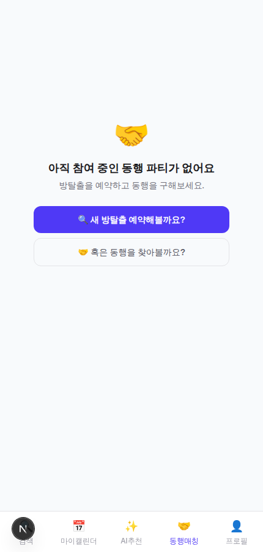
  
</p>

---

### 5. Personalized Recommendation

사용자의 플레이 기록과 선호 정보를 활용해 다음 방탈출 테마를 추천함

추천 데이터는 **Neo4j 기반 그래프 구조**로 관리

현재 프로토타입에서는 별도의 대규모 학습 파이프라인 대신 다음 정보를 활용하는 lightweight ranking 방식을 사용

- Theme tag similarity
- User preference
- Weak-stat compensation

<p align="center">
  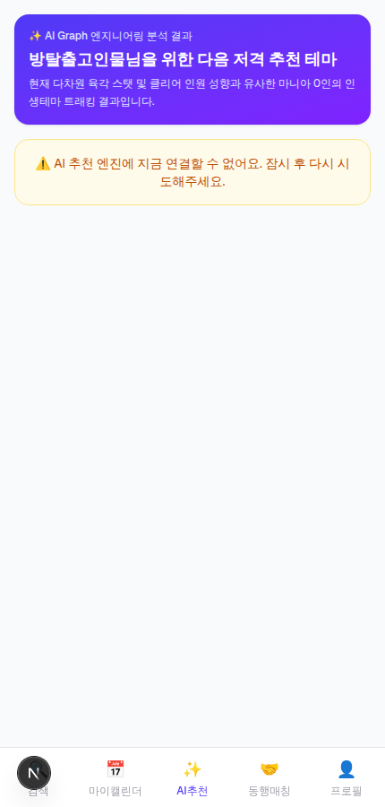
</p>

---

### 6. 리뷰

플레이한 테마에 대해 리뷰를 작성하고 이후 검색 및 추천에 활용할 수 있도록 구성했음

<p align="center">
  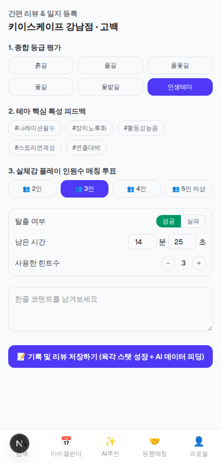
</p>

---

## System Architecture

TALTAL은 하나의 모놀리식 애플리케이션보다는 각 역할을 분리한 **multi-service architecture**로 구성했음

```text
                         ┌───────────────────────┐
                         │       Next.js         │
                         │         Web           │
                         └───────────┬───────────┘
                                     │
                                     ▼
                         ┌───────────────────────┐
                         │        NestJS         │
                         │          API          │
                         └──────┬────────┬───────┘
                                │        │
                       ┌────────┘        └─────────┐
                       ▼                           ▼
              ┌────────────────┐         ┌────────────────┐
              │   PostgreSQL   │         │ Redis / MQ     │
              │     Prisma     │         │ RabbitMQ       │
              └────────────────┘         └───────┬────────┘
                                                 │
                                                 ▼
                                         ┌────────────────┐
                                         │ Python Scraper │
                                         └────────────────┘

                         NestJS API
                              │
                              ▼
                     ┌──────────────────┐
                     │ FastAPI AI Engine│
                     └─────────┬────────┘
                               │
                               ▼
                         ┌───────────┐
                         │   Neo4j   │
                         └───────────┘
```

### Service Structure

```text
apps/
├── web/          # Next.js frontend
├── api/          # NestJS backend
├── scraper/      # Python data collection service
└── ai-engine/    # FastAPI recommendation service
```

전체 infrastructure는 `docker-compose.yml`을 통해 실행할 수 있도록 구성함

---

## Tech Stack

| Layer | Technologies |
|---|---|
| Frontend | Next.js, TypeScript |
| Backend | NestJS, Prisma |
| Database | PostgreSQL |
| Authentication | JWT, bcrypt, httpOnly Cookie |
| Cache | Redis |
| Message Queue | RabbitMQ |
| AI / Recommendation | FastAPI, Python, Neo4j |
| Infrastructure | Docker Compose |

---

## Authentication

기본 회원가입 및 로그인은 실제 인증 플로우로 구현

```text
Client
  ↓
Next.js
  ↓
NestJS Auth API
  ↓
bcrypt password verification
  ↓
JWT
  ↓
httpOnly session cookie
```

인증이 필요한 API에서는 클라이언트에서 전달된 `userId`를 그대로 신뢰하지 않고 JWT에서 검증한 사용자 정보를 사용함

소셜 로그인 구조도 다음 provider를 대상으로 구현했음

- Kakao
- Naver
- Google

OAuth credential을 설정하면 실제 provider와 연결할 수 있으며, credential이 없는 개발 환경에서도 애플리케이션이 동작할 수 있도록 fallback 처리함

---

## Data

프로토타입의 테마 탐색 경험을 구현하기 위해 서울 지역 방탈출 데이터를 구축

- 약 **180개 매장**
- 약 **400개 테마**
- 테마명
- 장르
- 난이도
- 가격
- 평점 등

매장 위치 탐색에는 Kakao Local API를 활용했으며, 일부 테마 정보는 공개된 방탈출 커뮤니티 및 리뷰 플랫폼 정보를 교차 확인하여 구성했음

> 해당 데이터는 연구용 benchmark나 공식 상업 데이터셋이 아닌 개인 프로젝트의 UI 및 서비스 로직 검증을 위한 프로토타입 데이터임

---

## Implementation Scope

TALTAL은 실제 제품에 가까운 구조를 실험하기 위한 프로젝트이지만, 모든 외부 서비스가 production 환경과 연결되어 있는 것은 아님

### Implemented

다음 요소는 실제 동작하는 형태로 구현했음.

- Next.js frontend
- NestJS REST API
- PostgreSQL + Prisma
- JWT authentication
- Redis integration
- RabbitMQ messaging
- Neo4j graph database
- FastAPI recommendation service
- Docker Compose development environment
- Social OAuth flow
- Booking / review / profile / party APIs

Redis 또는 RabbitMQ가 실행되지 않는 환경에서도 주요 API가 계속 동작할 수 있도록 fallback 처리를 적용했음

### Mocked External Integrations

실제 외부 사업자 계정이나 production credential이 필요한 부분은 동일한 interface의 mock adapter로 분리함

```text
Escape-room availability source
└── apps/scraper/app/mock_source.py

Naver CLOVA OCR
└── apps/api/src/common/adapters/ocr/
    └── clova-ocr-mock.adapter.ts

PortOne payment
└── apps/api/src/common/adapters/payment/
    └── portone-mock.adapter.ts
```

이를 통해 애플리케이션 로직을 외부 provider 구현과 분리하고, 이후 실제 adapter로 교체할 수 있도록 구성했음

### Recommendation

Neo4j 그래프 구조와 recommendation serving pipeline은 실제로 구현되어 있음

다만 현재 버전에서는 GraphSAGE / Node2Vec 등의 별도 학습 pipeline을 운영하지 않고 다음 정보를 기반으로 추천 점수를 계산

- Theme tag similarity
- User preference
- Weak-stat compensation

서비스 규모를 고려해 별도의 모델 학습 없이 동작 가능한 lightweight recommendation 방식을 선택

---

## Quick Start

### Frontend Demo

가장 간단하게 UI를 확인하려면 frontend만 실행

```bash
cd apps/web

npm install
npm run dev
```

`API_BASE_URL`을 설정하지 않으면 frontend가 mock fixture를 사용

```text
Splash
 → Login
 → Home
 → Theme
 → Booking
 → Party
 → Profile
 → Recommendation
```

따라서 별도의 backend 설정 없이 주요 UI 플로우를 확인할 수 있음

---

## Run Full Stack

전체 서비스는 Docker Compose로 실행할 수 있음

```bash
docker compose up --build
```

### Services

| Service | Address |
|---|---|
| Web | `http://localhost:3000` |
| API | `http://localhost:4000` |
| AI Engine | `http://localhost:8000` |
| Neo4j Browser | `http://localhost:7474` |
| RabbitMQ | `http://localhost:15672` |

PostgreSQL seed:

```bash
docker compose exec api npm run prisma:seed
```

Neo4j recommendation graph seed:

```bash
curl -X POST http://localhost:8000/internal/seed
```

---

## Run Without Docker

Redis와 RabbitMQ 없이도 기본 API를 실행할 수 있도록 구성

### API

```bash
cd apps/api

npm install

npx prisma generate
npx prisma migrate deploy
npm run prisma:seed

npm run start:dev
```

Minimum environment variables:

```env
DATABASE_URL=
JWT_SECRET=
INTERNAL_API_SECRET=
```

### Web

```bash
cd apps/web

npm install
npm run dev
```

`.env.local`

```env
API_BASE_URL=http://localhost:4000
```

---

## Screens

### Onboarding

<p align="center">
  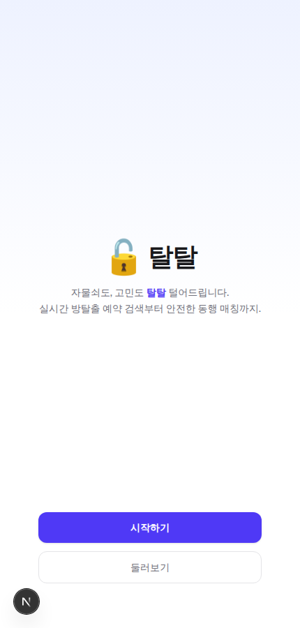
  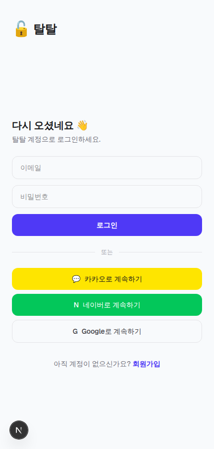
  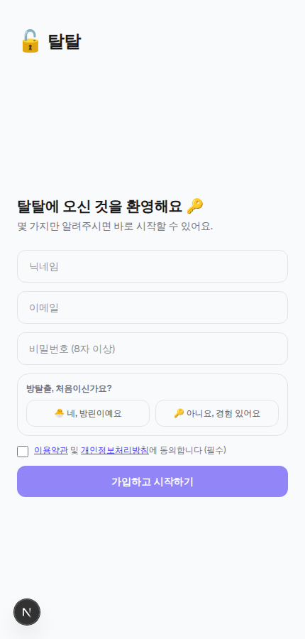
  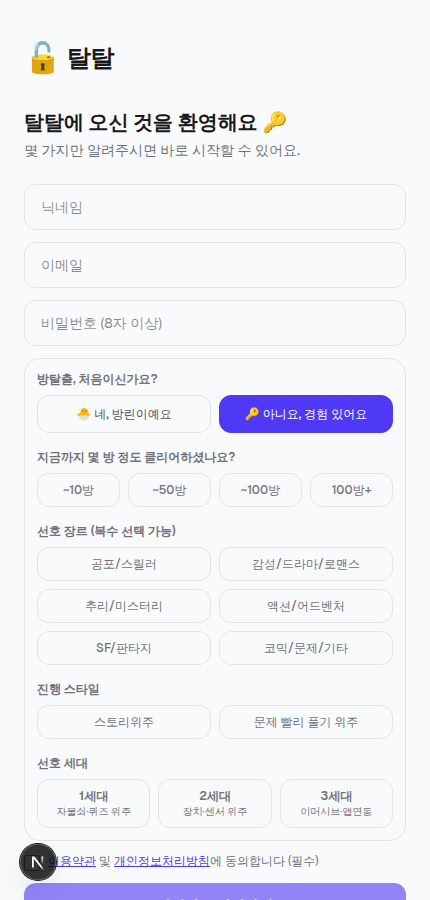
</p>

### Search & Booking

<p align="center">
  
  
  
  
</p>

### Community & Personalization

<p align="center">
  
  
  
  
</p>

---

## Project Status

TALTAL은 **개인 프로토타입 프로젝트**

실제 상용 방탈출 플랫폼을 그대로 재현하는 것보다는 하나의 제품 아이디어를 직접 설계하고 다음 요소를 end-to-end로 구현해보는 것을 목표로 했음

- Frontend UX
- Backend domain design
- Authentication
- Asynchronous infrastructure
- External service abstraction
- Graph-based personalization
- Multi-service architecture

아이디어 단계에서 끝내지 않고 실제로 동작하는 서비스 형태까지 구현하면서 **제품 설계부터 frontend, backend, infrastructure, recommendation까지 전체 개발 과정을 경험하는 것**에 중점을 둔 프로젝트
