# 탈탈 (TalTal) — 방탈출 통합 플랫폼

"자물쇠도, 고민도 탈탈 털어드립니다." 

실시간 예약 검색, 게이미피케이션
육각 스탯 프로필, 하이브리드 리뷰, 안전 에스크로 동행 매칭, Neo4j 그래프 기반 AI
추천

5개 핵심 도메인 및 그 주변을 감싸는 앱 셸(스플래시/로그인/예약/파티개설 등) 화면까지 구현

## 빌드 범위
**풀스택 아키텍처 + 목업 외부 연동** 범위
- 프레임워크/DB/메시지 브로커/그래프DB 모두 **실제동작** (Next.js,
  NestJS, PostgreSQL, Redis, RabbitMQ, Neo4j).
- 아래 3가지는 실제 계정·크롤링 대상이 없어 **동일한 인터페이스의 목업 구현체**로
  대체함. 나중에 키/대상이 생기면 교체예정
  - **방탈출 매장 크롤링** → `apps/scraper/app/mock_source.py` (시드 기반 재현 가능한 가짜 예약 데이터)
  - **Naver CLOVA OCR** → `apps/api/src/common/adapters/ocr/clova-ocr-mock.adapter.ts`
  - **포트원(PortOne) 에스크로 결제** → `apps/api/src/common/adapters/payment/portone-mock.adapter.ts`
- **GraphSAGE/Node2Vec 학습 파이프라인**도 실제 학습 데이터·GPU 배치잡 X<br>
  동일한 Neo4j 그래프 스키마 위에서 태그 코사인 유사도 + 취약 스탯 보정 점수를
  계산하는 경량 대체 알고리즘(`apps/ai-engine/app/recommend.py`)으로 구현함<br>
  Neo4j 자체와 그래프 스키마는 실제 구현완료
- **로그인/회원가입: 실제 인증 시스템** (`apps/api/src/modules/auth`) — bcrypt
  비밀번호 해싱 + JWT 발급/검증, Next.js가 httpOnly 세션 쿠키를 관리하며
  `proxy.ts`가 비로그인 사용자를 보호된 화면에서 리다이렉트함 <br>
  `API_BASE_URL`을 설정하지 않은 목업 모드에서는 여전히 로그인 없이 데모 가능
  리뷰/파티/프로필/캘린더/추천 API도 전부 `JwtAuthGuard`로 보호되어, 클라이언트가
  보낸 `userId`가 아니라 토큰에서 검증된 사용자 본인의 데이터만 조회·수정됨<br>
- **소셜 로그인(카카오/네이버/Google)은 코드까지 준비되어 있지만, 실제 발급받은
  OAuth 클라이언트 ID/Secret이 없어 실제 테스트 필요** <br>
  로그인 화면의 소셜 버튼 → `apps/web/app/api/oauth/[provider]` (인가 리다이렉트) →
  `.../callback` (코드 교환 + 프로필 조회) → NestJS의 내부 전용 `POST /auth/social`
  (Next.js 서버만 호출 가능하도록 `x-internal-secret` 공유 비밀값으로 보호) 순으로
  이어지는 전체 플로우는 구현되어 있음<br>
  각 프로바이더 개발자 콘솔에서 앱을 등록해 `KAKAO_CLIENT_ID` 등 환경변수를 채우면 바로 동작
  — 비워두면 로그인 화면에서 해당 버튼 클릭 시 "아직 연동 준비 중" 안내로 복귀
- 디자인 톤앤매너는 **라이트 모드** 기준으로 통일
<br>

## 아키텍처

```
apps/
  web/        Next.js (App Router) — 모바일 최적화 웹뷰, 전체 화면
  api/        NestJS (DDD 모듈러) — Prisma/PostgreSQL, Redis, RabbitMQ, 에스크로/OCR 어댑터
  scraper/    Python — 비동기 목업 크롤러, RabbitMQ 컨슈머, Redis 캐시 적재
  ai-engine/  Python (FastAPI) — Neo4j 그래프 기반 추천 서빙
docker-compose.yml   postgres / redis / rabbitmq / neo4j / api / scraper / ai-engine / web
```
<br>

## 화면 Wireframe - 초안
### 로그인/회원가입
<div style="display: flex; overflow-x: auto; white-space: nowrap; gap: 10px;">
  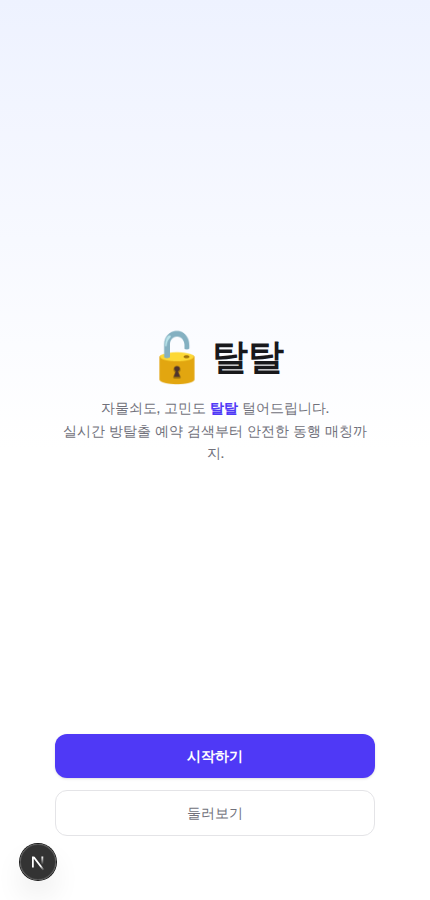
  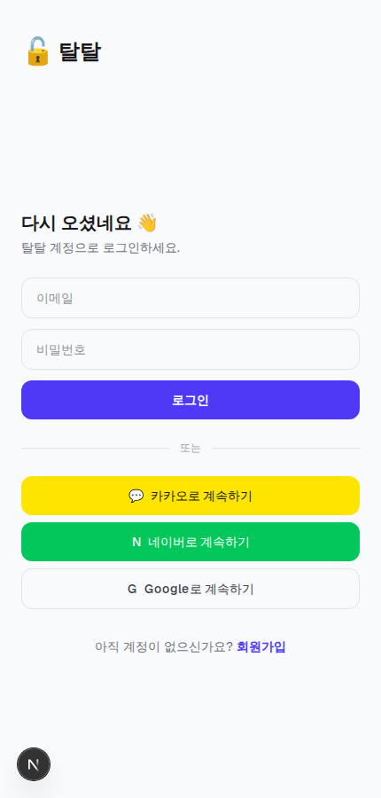
  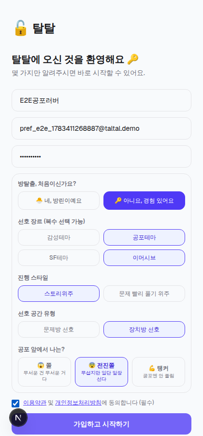
</div> <br>

### 전체테마 검색 및 예약창 (현재 위치기반, 위치 선택가능)
<div style="display: flex; overflow-x: auto; white-space: nowrap; gap: 10px;">
  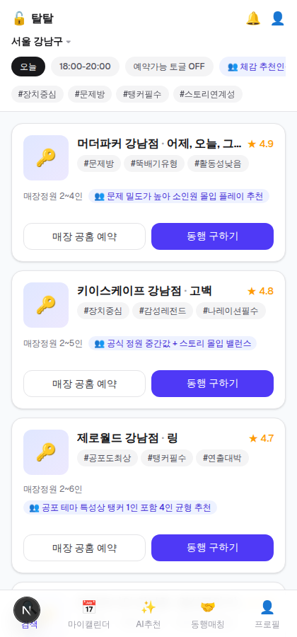
  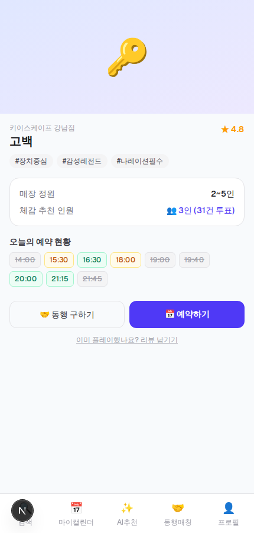
  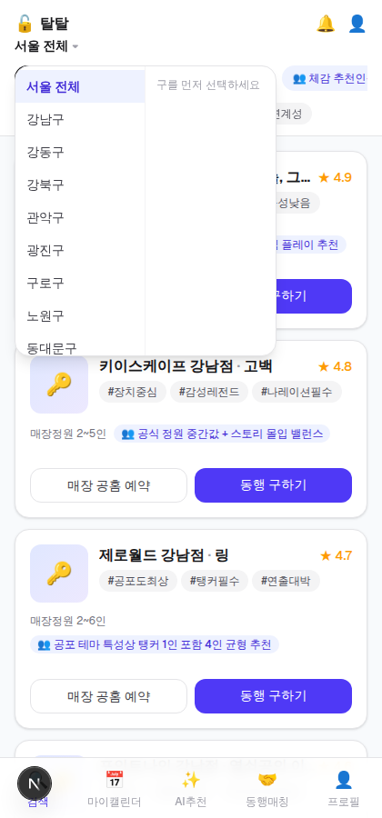
  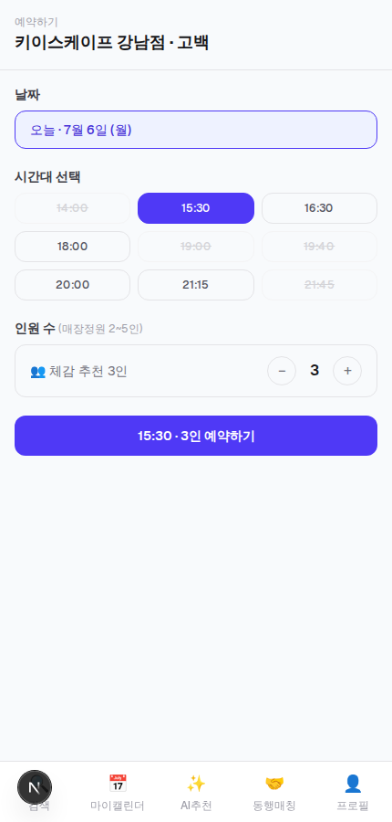
  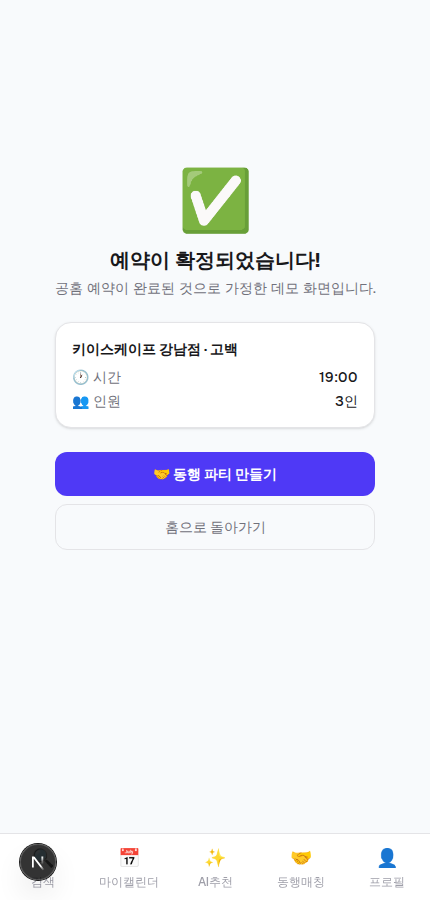
</div> <br>

### 동행구하기 기능
<div style="display: flex; overflow-x: auto; white-space: nowrap; gap: 10px;"> 
  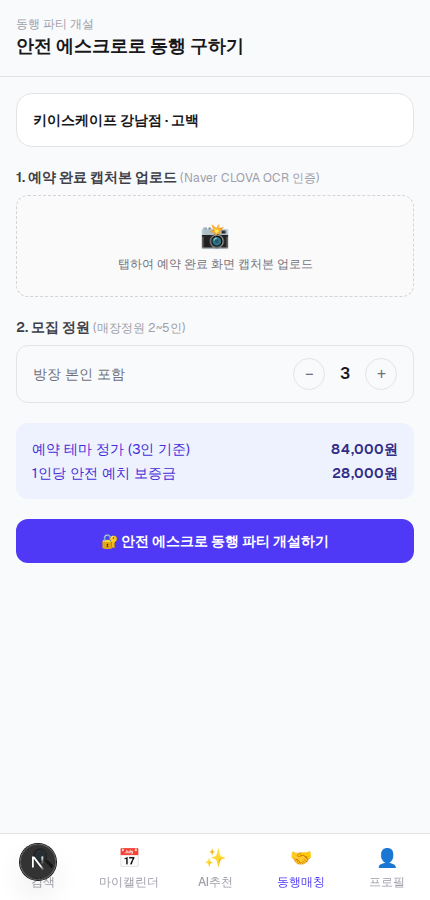
  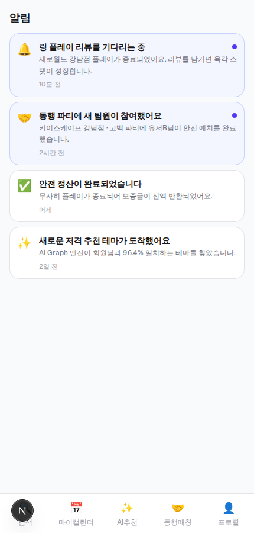
</div> <br>


### 프로필화면
<div style="display: flex; overflow-x: auto; white-space: nowrap; gap: 10px;">
  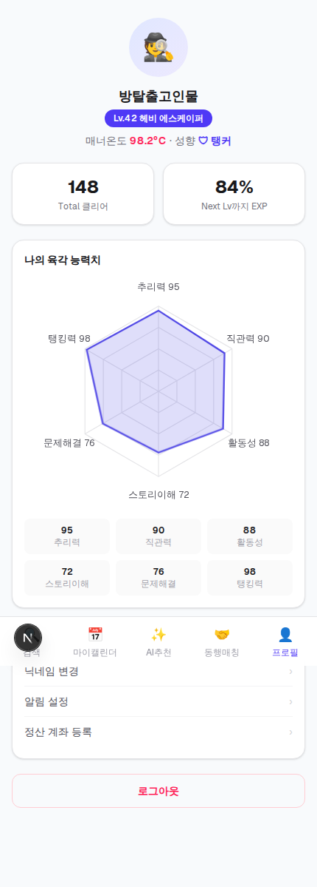
</div> <br>

<br><br>

## 화면 구조 (`apps/web/app`)

앱 셸 (인증 전/공용):

| 화면 | 경로 |
|---|---|
| 시작 화면 (스플래시) | `/` |
| 로그인 | `/login` |
| 회원가입 | `/signup` |
| 알림 | `/notifications` |

5개 핵심 도메인 ↔ 코드 매핑:

| 도메인 | 화면 | 백엔드 |
|---|---|---|
| 1. 실시간 통합 검색 | `/home` | `apps/api/src/modules/search`, `apps/scraper` |
| 2. 마이캘린더 & 육각 스탯 | `/calendar`, `/profile` | `apps/api/src/modules/stats` (UserStatCalculator, Webhook 스케줄러) |
| 3. 하이브리드 리뷰 | `/themes/[themeId]/review` | `apps/api/src/modules/reviews` |
| 4. 안전 에스크로 동행 매칭 | `/party/[id]`, `/party/new` | `apps/api/src/modules/party` (OCR/결제 어댑터, 정산 스케줄러) |
| 5. Neo4j 그래프 AI 추천 | `/recommendations` | `apps/ai-engine` (Neo4j) ↔ `apps/api/src/modules/recommendation` (프록시) |

테마 상세 & 예약 플로우 (도메인 1·4를 잇는 화면):

| 화면 | 경로 |
|---|---|
| 테마 상세 | `/themes/[themeId]` |
| 예약 폼 | `/themes/[themeId]/book` |
| 예약 완료 | `/themes/[themeId]/book/complete` |
| 동행 파티 개설 (OCR 업로드) | `/party/new` |

<br>

## 실행 방법

### 방법 A — 프론트엔드만 (외부 인프라 없이 즉시 데모)

```bash
cd apps/web
npm install
npm run dev
```

`API_BASE_URL` 환경변수를 설정하지 않으면 `apps/web/lib/mock-data.ts`의 인메모리
픽스처로 모든 화면이 즉시 동작합니다 (백엔드 서버 필요 없음). 
`/`(스플래시)부터 시작해서 로그인 → 홈 → 테마 상세 → 예약 → 동행 파티 개설까지 전체 플로우를 눌러볼 수 있습니다.

### 방법 B — 전체 스택 (Docker Compose)

```bash
docker compose up --build
```

- web: http://localhost:3000 (API_BASE_URL이 자동으로 NestJS API를 가리킴)
- api: http://localhost:4000
- ai-engine: http://localhost:8000 (최초 1회 `POST /internal/seed` 호출로 Neo4j 시드)
- neo4j browser: http://localhost:7474 (neo4j / roommate-dev-pw)
- rabbitmq management: http://localhost:15672 (guest / guest)

최초 기동 후 Postgres 시드가 필요합니다:

```bash
docker compose exec api npm run prisma:seed
curl -X POST http://localhost:8000/internal/seed
```

### 인증 관련 환경변수

| 변수 | 어디서 | 설명 |
|---|---|---|
| `JWT_SECRET`, `JWT_EXPIRES_IN` | api | JWT 서명 비밀값/만료 기간. 실서비스에서는 반드시 교체할 것 |
| `INTERNAL_API_SECRET` | api, web (동일한 값) | web(Next.js)만 `POST /auth/social`을 호출할 수 있도록 하는 공유 비밀값 |
| `APP_BASE_URL` | web | OAuth `redirect_uri` 생성 기준 도메인 (Host 헤더를 신뢰하지 않기 위해 명시적으로 설정) |
| `KAKAO_CLIENT_ID` / `_SECRET` | web | 카카오 개발자 콘솔에서 앱 등록 후 발급 |
| `NAVER_CLIENT_ID` / `_SECRET` | web | 네이버 개발자 콘솔에서 앱 등록 후 발급 |
| `GOOGLE_CLIENT_ID` / `_SECRET` | web | Google Cloud Console에서 OAuth 클라이언트 등록 후 발급 |

소셜 로그인 변수를 비워두면 로그인 화면의 해당 버튼은 클릭 시 `/login?oauthError=not_configured`로
안전하게 돌아오며 안내 메시지를 보여줍니다 (에러 없이 동작).

카카오는 정책상 이메일 동의항목을 비즈니스 인증(사업자등록) 완료 앱에만 열어주기 때문에,
일반 개발자 앱은 닉네임만 받아올 수 있습니다. 이 경우 `apps/web/lib/oauth-providers.ts`가
`kakao_{카카오ID}@kakao.taltal.local` 형태의 내부 전용 placeholder 이메일을 자동 생성해
계정을 만듭니다 (사용자에게 노출되지 않는 식별용 값).

## 검증한 것
- `apps/api`: `npm run build` (Nest/TS 컴파일) 통과
- `apps/web`: `npm run build`, `npm run lint` 통과 (14개 라우트 전부 컴파일)
- `apps/web`: Playwright로 전체 화면 스크린샷 확인 + 아래 상호작용 테스트를
  실제 브라우저에서 완료
  - 리뷰 제출 → 육각 스탯 실시간 성장 → 캘린더 Pending 배지 소멸
  - 스플래시 → 로그인 → 홈 → 테마 상세 → 예약 폼 → 예약 완료 → 동행 파티 개설
    (OCR 캡처본 업로드 mock) → 새로 생성된 파티 상세 페이지까지 전체 플로우,
    콘솔 에러 없음
- `apps/scraper`, `apps/ai-engine`: Python 구문 검사(`py_compile`) 통과
- 인증(`apps/api/src/modules/auth`): 로컬 PostgreSQL/Redis를 직접 기동해 real DB
  기준으로 `prisma migrate dev` 적용 + API 서버 구동 후, 회원가입 → 로그인 →
  `/auth/me` → 보호된 화면 접근 → 로그아웃 → 재로그인 → 잘못된 비밀번호/중복
  이메일 에러까지 Playwright로 실제 브라우저에서 end-to-end 검증 완료.
- 인가 가드: `curl`로 실제 DB 기준 검증 — 미인증 리뷰 작성 401, 본인이 아닌
  `/users/:userId/profile` 조회 403, 소셜 로그인(`/auth/social`) 신규가입·기존
  이메일 계정 연동·재로그인 idempotency 확인, 내부 비밀값 없이 `/auth/social`
  호출 시 401.
- 소셜 로그인 프론트 배선: 로그인 화면의 카카오 버튼이 실제 링크로 렌더링되는지,
  클라이언트 ID 미설정 시 `/login?oauthError=not_configured`로 안전하게
  되돌아오며 안내 메시지가 뜨는지 Playwright로 확인. 실제 OAuth 인가 화면
  왕복 자체는 카카오/네이버/Google 개발자 콘솔에 앱을 등록해야 테스트 가능해
  이번 범위에서는 확인하지 못했습니다.
- 이 과정에서 `/login`, `/calendar`, `/profile`, `/recommendations` 화면이
  Docker 이미지 build 시점(런타임 환경변수가 아직 없는 시점)에 목업 모드로
  정적 프리렌더링되어 실제 배포 시 로그인 세션이 영구히 무시되는 잠재 버그를
  발견해 `lib/session.ts`가 항상 `cookies()`를 호출하도록 고쳐 동적 렌더링을
  강제했습니다.

